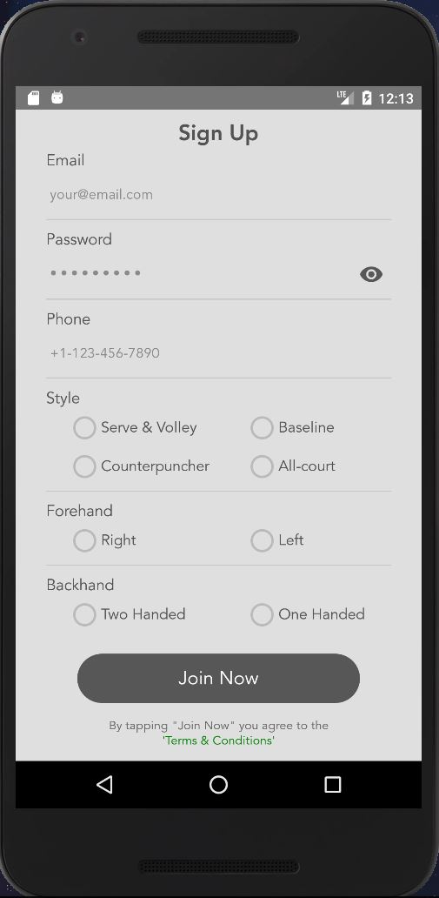
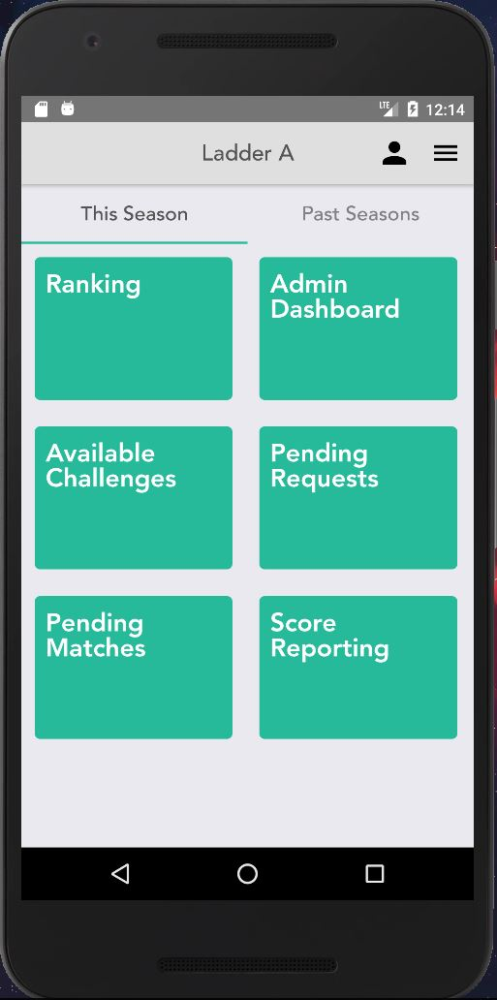

# The Open Tennis [Demo]

## Summary
"We plan to bring the world together with Tennis"

The Open Tennis is a Tennis Ladder mobile application that allows users to either join an existing ladder using their location or create their own.

With our app, not only users will be given the opportunity to enjoy Tennis like the professional players do, and add a little bit of rivalry and competitiveness to their playing. 

Ultimately, we want to gather passionate tennis players together. We are hoping to expand worldwide and incorporate other sports.

## Details

Users will be able to:

1. Report the scores of their matches instantly with their phones
2. Get notified of various news in the ladders they are part of
3. Request to join Ladders around them using GPA location service
4. Create their own ladders, and set specific rules for the ladder such as season start and end, the possibility of a back-to-back challenge, etc...
5. Challenge other players in the ladder
6. Evaluate their own ability using the official NTRP-S Rating System to get a feel of playing professionally

## Screens and Current Progress
The frontend design through React Native is at about 80%, and the integration to backend using AWS AppSync and GraphQL is happening concurrently and is sitting at about 40%. We plan to finish development by April 2019, and deploy the final product by June 2019 after thorough QA and testing processes are complete.

### Screens
#### Sign Up and Ladder Dashboard

  
   

### Wireframe
#### Ladder News and Available Challenges

